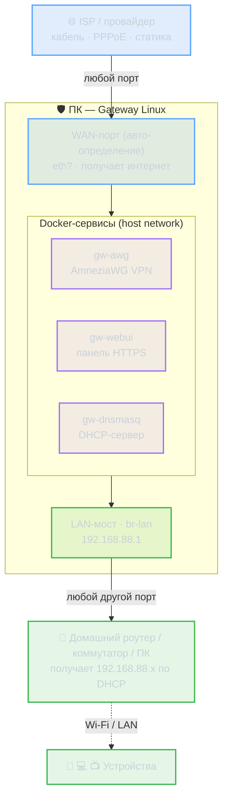
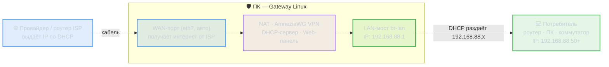
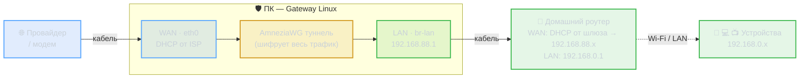
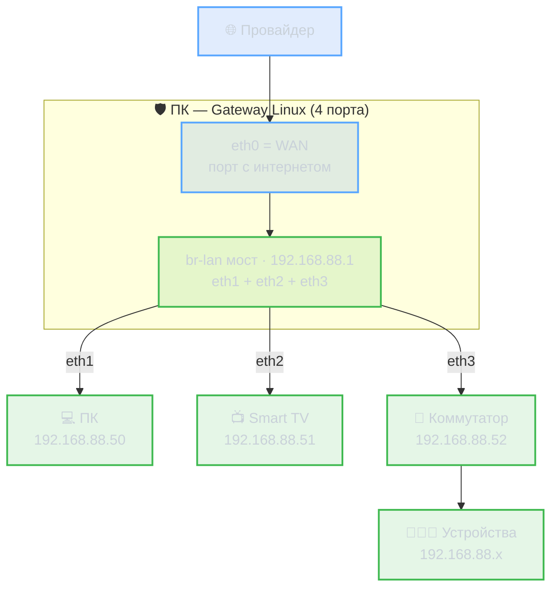
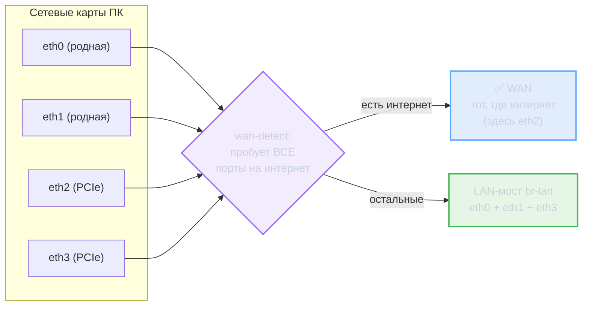
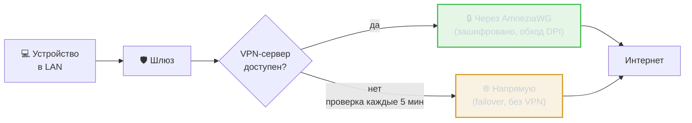
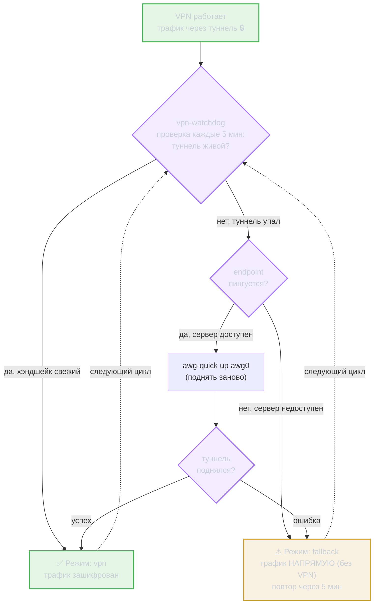

<div align="center">

# 🛡 Gateway Linux

### Прозрачный VPN-шлюз на AmneziaWG для любого x86-ПК

Старый ноут, неттоп или мини-ПК превращается в межсетевой экран
с обходом DPI, автонастройкой и веб-панелью — **из коробки**.


**[⬇ Скачать готовый образ](https://github.com/AnDyQnn/OpenWRT_AWG/releases)** ·
[📖 Документация](docs/README.md) ·
[💬 Поддержка](#-поддержка)

📚 **Полная техническая документация** — в папке **[`docs/`](docs/README.md)**:
[Архитектура](docs/architecture.md) · [Сборка](docs/build.md) · [Установка](docs/install.md) ·
[Веб‑панель](docs/webui.md) · [VPN и обход](docs/vpn-split-tunneling.md) ·
[Доступ](docs/access-control.md) · [Сеть](docs/networking-failover.md) · [Диагностика](docs/troubleshooting.md)

</div>

---

> ### 🔑 Доступы по умолчанию (дефолтные сборочные, не секретные)
>
> | Что | Адрес | Логин | Пароль |
> |-----|-------|-------|--------|
> | **Веб-панель** | `https://192.168.88.1` | `admin` | `admin` |
> | **Встроенная консоль** (вкладка «Консоль») | в браузере | `admin` | `admin` (**креды панели**) |
> | **SSH** (внешний клиент) | `root@192.168.88.1` | `root` | `openwrt` |
>
> **Про консоль:** встроенная **Консоль** в панели спрашивает **те же логин/пароль,
> что и сама панель** (`admin`/`admin`) — отдельный пароль помнить не нужно.
> Пароль `openwrt` нужен только для входа по **внешнему SSH-клиенту**.
>
> Это **стандартные пароли образа** — их видят все, кто скачал. **Смени их
> после установки:** пароль/учётки панели во вкладке «Система → Безопасность»,
> SSH-пароль командой `passwd`. При вводе пароля символы не отображаются — это
> нормально, просто печатай и жми Enter.

---

## 📋 Содержание

1. [Что это и зачем](#-что-это-и-зачем)
2. [Топология](#топология)
4. [Схемы подключения и адресация](#схемы-подключения-и-адресация)
5. [Архитектура](#архитектура)
6. [🚀 Установка — пошагово](#-установка--пошагово)
   - [Шаг 1. Скачать образ](#шаг-1--скачать-образ)
   - [Шаг 2. Записать на флешку (Rufus)](#шаг-2--записать-на-флешку-rufus)
   - [Шаг 3. Загрузиться и установить](#шаг-3--загрузиться-и-установить-на-диск)
   - [Шаг 4. Подключить кабели](#шаг-4--подключить-кабели)
   - [Шаг 5. Первый запуск (важно про интернет)](#шаг-5--первый-запуск--важно)
7. [Веб-панель Gateway Hub](#веб-панель-gateway-hub)
8. [Консольный дашборд](#консольный-дашборд)
9. [VPN failover](#vpn-failover-как-это-работает)
10. [Драйверы и определение сетевых карт](#драйверы-и-определение-сетевых-карт)
11. [Сборка образа из исходников](#сборка-образа)
12. [Тестирование](#тестирование)
13. [💬 Поддержка](#-поддержка)

---

## 🎯 Что это и зачем

**Проблема:** провайдер и государство блокируют сайты через DPI, а настраивать
VPN на каждом устройстве — морока.

**Решение:** ставим между провайдером и домашней сетью обычный старый ПК
с этим образом. Он поднимает зашифрованный туннель AmneziaWG (обход DPI) и
**прозрачно** гонит через него весь трафик — телефоны, ТВ, ноуты ничего не
замечают и не требуют настройки.

| | |
|---|---|
| 🔌 **Plug & play** | воткнул кабели → работает, порты определяются сами |
| 🛡 **Обход DPI** | AmneziaWG — трафик выглядит как шум, не детектируется |
| ♻️ **Самовосстановление** | упал VPN → прямой интернет → авто-возврат в туннель |
| 🖥 **Веб-панель** | управление по HTTPS из LAN, Wi-Fi или VPN |
| 💪 **Любое железо** | mainline-ядро Debian, драйверы всех сетевых карт |

---

> **Только x86-ПК.** Проект рассчитан на обычный компьютер (старый ноут, неттоп,
> мини-ПК) — Debian 12 mainline с драйверами всех сетевых карт, AmneziaWG из
> исходников, сервисы в Docker. Под роутеры/«железки» образ не предназначен —
> софт для них слишком тяжёлый.

---

## Топология



ПК **не важно** что на входе и выходе: провайдер может быть кабель/PPPoE,
потребитель — роутер, коммутатор или один ПК. Шлюз определяет порты,
поднимает DHCP на LAN и гонит трафик через VPN (или напрямую при сбое).

---

## Схемы подключения и адресация

> Диаграммы ниже отрисовываются графически на GitHub (Mermaid).

### Принцип: WAN (вход) → Шлюз → LAN (выход)



**Кто какой IP получает:**

| Узел | IP-адрес | Откуда |
|------|----------|--------|
| WAN-порт шлюза | напр. `192.168.1.50` | DHCP от провайдера/роутера ISP (или статика) |
| LAN-мост шлюза (`br-lan`) | `192.168.88.1` | фиксированный, задаёт сам шлюз |
| Потребитель (роутер/ПК) | `192.168.88.50…200` | DHCP от шлюза (`gw-dnsmasq`) |
| Устройства за роутером | его подсеть (напр. `192.168.0.x`) | DHCP домашнего роутера |

> Подсеть LAN намеренно `192.168.88.0/24` — не пересекается с типичными
> `192.168.0.x` / `192.168.1.x` домашних роутеров, чтобы не было конфликта.

---

### Схема 1 — Один потребитель (роутер за шлюзом)



Роутер настраивать **не нужно** — его WAN стоит на «DHCP» (заводской дефолт),
он получит `192.168.88.x` от шлюза и будет раздавать свою сеть как обычно.
VPN поднимается **внутри шлюза** — весь трафик за роутером идёт зашифрованным.

---

### Схема 2 — Несколько потребителей (много портов)



Шлюз сам понимает: порт где есть интернет → WAN, **все прочие** → в общий
мост `br-lan`. Хоть 1, хоть 3 потребителя — все получают `192.168.88.x`
и делят один зашифрованный канал.

---

### Схема 3 — 2 родные + 2 PCIe сетевухи



Не зашито на конкретный порт — берёт тот, где **реально есть интернет**
(не важно родная карта или доп.). Переткнул провод → ребутнул → переопределит.

---

### Поток трафика: VPN и failover



Пользователь не теряет интернет даже если VPN-сервер лёг — трафик идёт
напрямую и автоматически возвращается в туннель, когда сервер поднимется.

---

### Адреса доступа к панели

| Откуда подключаешься | Адрес панели |
|----------------------|--------------|
| Кабель в LAN-порт шлюза | `https://192.168.88.1` |
| Wi-Fi через роутер за шлюзом | `https://192.168.88.1` |
| Через VPN-туннель | `https://192.168.88.1` |
| С самого ПК-шлюза (консоль) | `gateway-status` |

Адрес `192.168.88.1` стабилен при **любом** способе подключения.
HTTPS, самоподписанный сертификат — порт указывать не нужно.

---

## Архитектура

### Хост (Debian 12 minimal)
Содержит только ОС + Docker + сетевые утилиты. Управляющие скрипты:

| Скрипт / команда | Когда | Что делает |
|------------------|-------|-----------|
| `gateway-installer` (`gateway-install`) | загрузка с USB | меню Y=установка / N=live, блокирует загрузку |
| `gateway-growroot.sh` | каждый старт | растит корневой раздел на весь диск |
| `gateway-swap.sh` | первый старт | swap-файл 2×RAM (2–8 ГБ), OOM-страховка |
| `gateway-init.sh` | каждый старт | IP-форвардинг, TUN, дефолты |
| `wan-detect.sh` | каждый старт | находит WAN-порт (+шлюз), строит br-lan, NAT |
| `gateway-load-images.sh` | каждый старт | `docker load` вшитых образов (без сборки) |
| `gateway-ready.sh` | после старта | баннер «GATEWAY ГОТОВ» на консоль |
| `gateway-status` | вручную | консольный дашборд |
| `gateway-vpn-debug` | вручную | диагностика туннеля (endpoint, MTU, маршруты) |

### Сервисы (Docker-контейнеры)

| Контейнер | База | Роль |
|-----------|------|------|
| `gw-awg` | Alpine | AmneziaWG-go туннель (бинарь скомпилирован при сборке образа) |
| `gw-dnsmasq` | Alpine | DHCP-сервер для LAN (192.168.88.10–250) |
| `gw-webui` | Python slim | FastAPI-дашборд + nginx (HTTPS) |

Контейнеры в режиме `network_mode: host` — видят `br-lan` и `awg0` напрямую.
Образы **вшиты в `.img`** (`/opt/gateway/images.tar`) и грузятся через
`docker load` — на целевом ПК сборки нет. Поднимаются `gateway-compose.service`.

### Самовосстановление

- **gateway-init / wan-detect** — переопределяют сеть при каждой загрузке
  (можно поменять железо/порты — переопределит само)
- **gateway-growroot** — раздел всегда на весь диск (любой размер цели)
- **Docker `restart: unless-stopped`** — упавший контейнер поднимается сам
- **Неубиваемая веб-панель** — внутри `gw-webui` nginx под супервизором
  (перезапуск при сбое), uvicorn авто-рестартится, а при проблеме с TLS
  панель уходит на HTTP, но не падает. Каждый шаг старта пишется в лог.
- **Диагностика на экране** — если контейнер не `Up`, `gateway-status`
  печатает его последние строки лога **прямо на мониторе** (видно причину
  без доступа к `docker logs`).
- **vpn-watchdog** (каждые 5 мин) — failover: VPN упал → прямой интернет →
  переподнятие; плюс переподтверждает маршрут к endpoint
- **sysmon** (каждую минуту) — рестартит упавшие сервисы, чистит память
- **weekly-report** (воскресенье) — отчёт + авто-перезагрузка

---

## Сборка образа

### Требования
- Docker Desktop (с поддержкой `--privileged`)
- ~8 ГБ свободного места

### Команда

```powershell
cd linux-gw
.\build.ps1
```

Сборка ~15–25 минут (1 раз):
1. Хост-образ (Debian + Docker)
2. **Образы контейнеров** (тут компилируется AmneziaWG из Go) — собираются на
   твоей машине и **вшиваются в `.img`** (`images.tar`)
3. `--privileged` контейнер создаёт загрузочный `.img`
4. Результат: `linux-gw/output/gateway.img.gz`

> **Важно:** контейнеры (включая AmneziaWG) собираются **здесь, на машине
> сборки**, и вшиваются в образ. На целевом ПК **ничего не компилируется** —
> первый старт просто `docker load` готовых образов (секунды, интернет для
> сборки не нужен). Это и решает проблему медленного/падающего билда на
> слабом железе.

---

## 🚀 Установка — пошагово

> Нужно: целевой ПК с минимум 2 сетевыми портами, флешка ≥ 4 ГБ,
> и второй компьютер чтобы записать флешку.

### Шаг 1 — Скачать образ

**[⬇ gateway.img.gz (≈807 МБ)](https://github.com/AnDyQnn/OpenWRT_AWG/releases/download/linux-gw-v2.1/gateway.img.gz)**

Распаковывать `.gz` вручную **не нужно** — Rufus сам разожмёт.

### Шаг 2 — Записать на флешку (Rufus)

1. Скачай и запусти **[Rufus](https://rufus.ie/)** (portable, установка не нужна)
2. Вставь флешку (всё, что на ней было — сотрётся)
3. Настрой Rufus:

   | Поле | Значение |
   |------|----------|
   | **Устройство** | твоя флешка |
   | **Метод загрузки** | → *Выбрать* → указать `gateway.img.gz` |
   | **Схема разделов** | GPT |
   | **Целевая система** | UEFI (non-CSM) |

4. Нажми **СТАРТ**
5. Выскочит предупреждение **«ВСЕ ДАННЫЕ БУДУТ УНИЧТОЖЕНЫ»** → **ОК**
6. Жди ~3–5 минут до статуса «Готов»

> 💡 **Про режим DD:** для `.img.gz` Rufus пишет в DD-режиме **автоматически**
> — отдельного окна выбора «ISO / DD» не будет (оно появляется только для
> `.iso`-файлов). Просто Старт → ОК → ждать. Это нормально.

> 💡 Образ гибридный: грузится и на **современных UEFI**, и на **старых Legacy
> BIOS**. Если на старом ПК не видит флешку — в BIOS выбери Legacy/CSM режим.

### Шаг 3 — Загрузиться и установить на диск

1. Вставь флешку в **целевой ПК**
2. Включи и зайди в **boot-меню**: при старте жми `F12` / `F11` / `F8` / `Esc`
   (зависит от материнки), выбери загрузку с **USB**
3. Появится **загрузочное меню** и **остановится, ожидая ответ**:

   ```
   ============================================================
    Gateway Linux  -  Boot menu
   ============================================================
     Y = INSTALL this system onto an internal disk (recommended)
     N = run LIVE from this USB now (portable, nothing is written)

     Internal disks available for installation:
       [1]  /dev/sdb  [120 GB]  Samsung SSD

     Install to disk? [Y/n] (N = live from USB):
   ```

   - **Y** (или просто Enter) → **установка на внутренний диск**
   - **N** → запуск **с флешки в live-режиме** (на диск ничего не пишется)

4. Для установки: нажми **Y** → выбери номер диска → напечатай **`yes`** для
   подтверждения → система копируется на диск (~2–3 мин)
5. «Installation finished» → **вытащи флешку** → Enter → ПК перезагрузится
   уже с диска

> Меню текстом на английском (на этом этапе консольный шрифт ограничен).
> Установленная система с диска **больше не показывает это меню** — только
> live-флешка. Пароль при вводе в консоли не виден — это нормально.
> Если установщик не появился сам — войди `root`/`openwrt` и запусти
> вручную: `gateway-install`.

### Шаг 4 — Подключить кабели

```
Провайдер ──→ [любой порт ПК]        ← WAN, определится сам
                    ПК
Роутер/ПК  ──→ [любой другой порт]    ← LAN, раздача 192.168.88.x
```

- **Кабель от провайдера** (или его модема/роутера) → в **любой** порт ПК
- **Любой другой порт** → к домашнему роутеру / коммутатору / компьютеру
- Какой порт WAN, а какой LAN — шлюз разберётся сам (см. [определение портов](#драйверы-и-определение-сетевых-карт))

### Шаг 5 — Первый запуск

> Первый старт **быстрый** — контейнеры уже вшиты в образ, на ПК ничего не
> компилируется. После загрузки растёт раздел на весь диск (growroot),
> создаётся swap, поднимаются контейнеры (`docker load`, ~1 минута).

Порядок:

1. Включи ПК с подключённым **кабелем провайдера**
2. Подожди ~1 минуту — на консоли появится зелёный баннер готовности:
   ```
   ✓ GATEWAY ГОТОВ К РАБОТЕ / GATEWAY READY
   Веб-панель : https://192.168.88.1   (admin / admin)
   Контейнеры : gw-awg gw-dnsmasq gw-webui
   ```
   (статус в любой момент: команда `gateway-status`)
3. Открой панель: **`https://192.168.88.1`**
   - браузер ругнётся на самоподписанный сертификат →
     *«Дополнительно» → «Перейти»* (это нормально и безопасно в своей сети)
   - логин **`admin`** / пароль **`admin`** (смени в «Система → Безопасность»)
4. Вкладка **VPN** → загрузи свой `.conf` AmneziaWG (файлом или текстом)
5. 🟢 Готово — весь трафик за шлюзом идёт через зашифрованный туннель

> Интернет нужен только для самого VPN-трафика, **не** для первого запуска.

**Доступы по умолчанию:**

| Что | Адрес | Логин | Пароль |
|-----|-------|-------|--------|
| Веб-панель | `https://192.168.88.1` | `admin` | `admin` |
| Встроенная консоль (вкладка) | в браузере | `admin` | `admin` (креды панели) |
| SSH (внешний клиент) | `root@192.168.88.1` | `root` | `openwrt` |

> Встроенная **Консоль** входит по **тем же кредам, что и панель** (`admin`/`admin`);
> `openwrt` — только для внешнего SSH.

---

## Веб-панель (Gateway Hub)

FastAPI-дашборд «межсетевой экран хаб». Доступен:
- по кабелю в LAN-порт ПК
- по Wi-Fi через подключённый роутер
- через VPN-туннель

**Адрес:** `https://192.168.88.1` (HTTPS, самоподписанный сертификат —
браузер предупредит, нажми «Дополнительно → Перейти»; порт указывать не нужно)
**Логин по умолчанию:** `admin` / `admin`

### Вкладки

| Вкладка | Содержание |
|---------|-----------|
| **Дашборд** | Живые метрики со спарклайнами: «Железо» (CPU, память, температура, диск I/O), «Сеть» (WAN/VPN/LAN трафик, устройства), сводка системы и VPN |
| **Сеть** | Интерфейсы (роль WAN/LAN/VPN, IP, скорость, трафик), подключённые устройства, DHCP-резерв адресов и имена |
| **VPN** | Статус туннеля, управление, загрузка/скачивание `.conf`, раздельное туннелирование |
| **Доступ** | Кастомный МЭ: блокировки, группы ресурсов, правила по устройствам (MAC), импорт/экспорт |
| **Консоль** | Встроенный терминал самого шлюза (вход по логину/паролю) + быстрые команды диагностики |
| **Журнал** | События с цветовой подсветкой |
| **Система** | Безопасность (учётные записи, смена логина/пароля, сброс админом), Справка, О проекте |
| **Документация** | Полная техническая документация |

### Доступ к ресурсам (кастомный firewall)

Шлюз работает как умный МЭ: по умолчанию открыт весь интернет, ограничения
задаются точечно. **Две разные сущности:**

- **Раздельное туннелирование** (вкладка VPN) — настройка *самого VPN*: какие
  домены идут напрямую мимо туннеля (банки, госуслуги). Применяется маршрутами.
- **Доступ к ресурсам** (вкладка Доступ) — *firewall для устройств*:
  - **Группы ресурсов** — именованный (лат/кир) набор доменов с описанием.
    Вписал `youtube.com` → набор доменов сервиса подставляется сам (каталог
    известных сервисов + авто-резолв в IP через `ipset`).
  - **Правила** — запрет группы с областью по MAC: всем / только этим
    (чёрный список) / всем кроме (белый список). Реализация — `iptables` с
    матчем по MAC устройства.
  - **Резерв адресов** — закрепление вечного IP за MAC (DHCP-резерв) + имя.
  - **Импорт/экспорт** всего набора правил строгим JSON.

> ⚠ Правила по устройству работают для клиентов **своего L2-сегмента** (прямых
> или через точку доступа в режиме мост/AP). За вложенным роутером в режиме NAT
> виден только один MAC — правило применяется ко всей его подсети целиком.

### API

| Endpoint | Метод | Описание |
|----------|-------|----------|
| `/api/login` | POST | Авторизация (cookie-сессия) |
| `/api/system` | GET | CPU, RAM, диск, uptime |
| `/api/network` | GET | Интерфейсы, роли, трафик |
| `/api/vpn` | GET | Статус AmneziaWG |
| `/api/vpn/up\|down\|restart` | POST | Управление туннелем |
| `/api/vpn/mode` | POST | `vpn_enable` / `vpn_disable` (persistent) |
| `/api/vpn/config` | POST | Загрузить `.conf` (нормализуется в 0.0.0.0/0) |
| `/api/vpn/config-download` | GET | Скачать конфиг (`current` / `original`) |
| `/api/devices` | GET | DHCP-аренды |
| `/api/access` | GET/POST | Правила доступа: блок/напрямую, группы, правила, хосты |
| `/api/access/group\|rule\|host` | POST | CRUD групп / правил / резервов |
| `/api/access/expand` | GET | Домен → авто-набор адресов ресурса |
| `/api/access/export\|import` | GET/POST | Выгрузка/загрузка правил JSON |
| `/api/logs` | GET | Журнал событий |

---

## Консольный дашборд

На самом ПК (или по SSH) — быстрый обзор без браузера:

```sh
gateway-status            # один снимок
watch -n3 gateway-status  # авто-обновление
```

Показывает: систему, WAN/LAN-порты и их IP, режим VPN, хэндшейк,
Docker-контейнеры, DHCP-аренды, последние события.

---

## SSH-доступ

```sh
ssh root@192.168.88.1
# пароль: openwrt
```

Сменить пароль: `passwd`.

---

## VPN failover (как это работает)



Пользователь не теряет интернет даже если VPN-сервер лёг — трафик
автоматически идёт напрямую и восстанавливается, когда сервер вернётся.

Режимы видны в веб-панели и `gateway-status`:
- `vpn` — туннель активен
- `fallback` — прямой интернет (VPN недоступен)
- `manual_off` — выключен вручную
- `no_config` — конфиг не загружен

### Endpoint всегда в обход туннеля (важно для split-tunnel)

Многие antifilter-конфиги задают `AllowedIPs` списком публичных подсетей,
в которые **попадает сам адрес VPN-сервера** (например endpoint `212.109.x`
внутри `212.0.0.0/8`). Тогда пакеты к серверу маршрутизировались бы **через
ещё не поднятый туннель** → хэндшейк не проходит (🟡 жёлтый, нет интернета
через VPN).

Шлюз это лечит автоматически: обёртка `awg-up` при каждом поднятии туннеля
(старт, загрузка конфига через панель, watchdog) добавляет **/32-маршрут к
endpoint через реальный WAN** — приоритетнее любой подсети из `AllowedIPs`.
Работает для **любого** конфига, ничего настраивать не надо.

> Диагностика, если хэндшейк всё же жёлтый: команда **`gateway-vpn-debug`**
> на шлюзе — покажет доступность endpoint, маршрут к нему, `awg show`, путь MTU.

---

## Тестирование

В `linux-gw/test/` есть набор сценариев для проверки на Docker:

```sh
cd linux-gw
bash test/test-scenarios.sh
```

Проверяет 11 сценариев:
1. Один сетевой адаптер
2. Перевёрнутые порты (WAN на eth1)
3. Три адаптера (eth0=WAN, eth1/eth2=LAN)
4. Отключение WAN → failover
5. Восстановление WAN → VPN восстанавливается
6. Принудительное падение VPN → watchdog
7. Падение сервиса → sysmon рестартит
8. Hot-plug LAN-порта
9. Потребитель получает IP по DHCP
10. Все API веб-панели
11. Полная перезагрузка

> Имитация драйверов NIC в Docker невозможна (там везде veth), но
> проверяется **логика определения** портов — а сами драйверы в Debian
> подхватываются ядром автоматически для реального железа.

### Локальный тест дашборда (без записи на диск)

```powershell
docker run -d --name gw-test --privileged `
  -e WAN_IFACE=eth0 -e LAN_IFACE=eth1 `
  -v "C:/path/to/your.conf:/etc/amnezia/awg0.conf:ro" `
  -p 8888:80 `
  gateway-linux:latest /usr/local/bin/run-test.sh

# Открыть http://localhost:8888  (admin / gateway)
```

---

## Драйверы и определение сетевых карт

### Драйверы — автоматически

- **Mainline-ядро Debian** (`linux-image-amd64`) содержит модули практически
  всех Ethernet-контроллеров: Realtek (r8169/r8168/r8152), Intel (e1000e/igb/
  igc/ixgbe), Broadcom (tg3/bnx2/bnx2x), Atheros (alx), Aquantia (atlantic),
  Nvidia (forcedeth) и др.
- **udev** загружает нужный модуль автоматически по PCI/USB modalias —
  ничего настраивать не надо.
- **Firmware-блобы** для карт, которым они нужны (многие Realtek, Broadcom,
  Intel), включены в образ: `firmware-realtek`, `firmware-bnx2`,
  `firmware-bnx2x`, `firmware-atheros`, `firmware-misc-nonfree` и др.

Итог: воткнул карту → ядро подняло драйвер → `wan-detect` её увидел.
Работает для **родных** сетевых мам и **PCIe/USB**-адаптеров одинаково.

### Определение портов — по наличию интернета

`wan-detect.sh` при каждой загрузке:

1. Находит все физические Ethernet-интерфейсы (по `type=1`, исключая
   виртуальные: `br-*`, `docker*`, `veth*`, `awg*`, `wlan*` …).
2. **Поднимает все порты и ждёт согласования линка** (до ~6 с) — чтобы
   onboard-сетевую, которая на старте ещё «down», не счесть пустой.
3. Для каждого с активным кабелем (`carrier=1`) проверяет **наличие
   интернета** (DHCP или статический IP → ping `8.8.8.8`).
4. **Первый порт с интернетом → WAN.** **Все остальные физические порты**
   (включая сейчас пустые PCI) → мост `br-lan`, поэтому клиента можно
   воткнуть в **любой свободный порт** — он сразу заработает.
5. Поднимает DHCP-сервер на `br-lan` и NAT с WAN.

**Сценарии (проверено тестом на 4 NIC):**

| Конфигурация | Результат |
|--------------|-----------|
| 2 родные сетевухи | интернет-порт → WAN, второй → LAN |
| 2 родные (вход/выход) + 2 пустых PCI | интернет → WAN, остальные 3 порта в мосту — клиент в любой |
| Больше 2 кабелей | один WAN (интернет), все прочие делят интернет через мост |
| Перевёрнутые порты | не зашит на eth0 — берёт тот, где реально интернет |
| Статический WAN | если на порту уже есть IP — использует его (не ломает DHCP) |
| Кабель воткнут позже | порт уже в мосту — заработает сразу, как появится линк |

Не важно, что на входе (кабель/PPPoE/статика) и на выходе (роутер/коммутатор/
один ПК) — шлюз определяет роли сам.

### При смене железа

- **Перезагрузка** — `wan-detect` отрабатывает заново, переопределяет порты.
  Поменял карту / переткнул кабели → просто ребутни.

---

## Почему вероятность запуска «из коробки» высокая

1. **Mainline-ядро Debian** + firmware-пакеты — драйверы NIC из коробки
2. **Определение портов по интернету**, а не по именам — не зависит от железа
3. **Переопределение при каждой загрузке** — поменял железо/кабели → ребут
4. **EFI + Legacy BIOS** загрузчики — и новый, и старый ПК
5. **Docker-сервисы** изолированы — сбой одного не роняет систему

---

## Структура

```
linux-gw/
├── Dockerfile              ← хост-образ (Debian + Docker + firmware)
├── build.ps1               ← сборка: образ + контейнеры → вшивает в .img
├── create-image.sh         ← создание .img (GPT + EFI + BIOS, static grub)
├── rootfs-overlay/         ← файлы на хост-систему
│   ├── etc/systemd/system/ ← сервисы (installer, growroot, swap, init,
│   │                          wan-detect, compose, ready, watchdog…)
│   ├── etc/docker/         ← daemon.json (overlay2 store)
│   └── usr/local/bin/      ← gateway-installer/growroot/swap/status/vpn-debug…
├── gateway/                ← Docker-проект сервисов
│   ├── docker-compose.yml
│   ├── awg/                ← VPN-контейнер + awg-up (исключение endpoint)
│   ├── dnsmasq/            ← DHCP-контейнер
│   └── webui/              ← FastAPI-дашборд + nginx
└── test/                   ← скрипты тестов (VBox, load, e2e)
```

---

## 💬 Поддержка

<div align="center">

**Проект создан и поддерживается одним человеком.**
Если оказался полезен — поставь ⭐ на [GitHub](https://github.com/AnDyQnn/OpenWRT_AWG), это лучшая благодарность.

| | |
|---|---|
| 👨‍💻 **Автор** | AnDy — DevOps-разработчик |
| 🐙 **GitHub** | [github.com/AnDyQnn](https://github.com/AnDyQnn/) |
| 🐞 **Баги/идеи** | [Issues](https://github.com/AnDyQnn/OpenWRT_AWG/issues) |
| 📜 **Лицензия** | [MIT](LICENSE) — свободно для личного и коммерческого |

*powered by AnDy*

</div>
